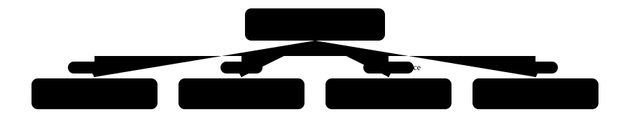

:::category Tabulaire {#dlcat-tabular}
features numériques/catégorielles en colonnes, comme pour du ML classique — pas de structure spatiale ou temporelle à exploiter.
:::

Toujours un réseau **Dense (DNN)**, cf. [Neurone, Layer, Réseau](#dl-neuron-network) — la tâche ne détermine que la couche de sortie (cf. [Construire l'architecture — règles de choix](#dl-architecture-rules)), jamais l'architecture elle-même.

> [!TIP]
> 👉 Sur du tabulaire, le Machine Learning classique (Random Forest, Gradient Boosting...) reste souvent PLUS performant et bien plus rapide à entraîner qu'un DNN — le Deep Learning brille surtout sur des données non structurées (image/séquence/texte). Cf. [Choisir son modèle](#ml-model-selection), groupe Machine Learning, avant de partir sur un DNN par défaut.

---

:::category Image {#dlcat-image}
tensor (hauteur, largeur, channels) — cf. [Pourquoi pas un réseau Dense pour les images](#dl-cnn-why-not-dense).
:::

| Tâche | Architecture à essayer d'abord | Si peu de données |
|---|---|---|
| Classification / régression sur image | [[P:Conv2D\|CNN\|dl-cnn-convolution]] | [[P:VGG16\|Transfer Learning\|dl-cnn-transfer-learning]] (geler les couches de convolution pré-entraînées) |
| Génération d'image (texte → image) | [[P:StableDiffusionPipeline\|Modèle de diffusion\|dl-diffusion-models]] | \- |
| Compression / débruitage | [[P:Autoencoder\|\|dl-autoencoder]] | \- |

---

:::category Séquence temporelle {#dlcat-sequence}
dimension temporelle, X.shape = (n_séquences, n_observations, n_features) — cf. [Pourquoi un RNN](#dl-rnn-input-shape).
:::

| Contexte | Architecture à essayer d'abord | Alternative |
|---|---|---|
| Dépendances temporelles à mémoriser | [[P:LSTM\|RNN (LSTM/GRU)\|dl-rnn-zoology]] | [[P:SimpleRNN]] si séquences courtes (moins de vanishing gradient à gérer) |
| Peu de features, série univariée simple | \- | statistique classique : [[NP:SARIMAX\|ARIMA/SARIMA\|ts-arima]] (groupe Machine Learning) — souvent suffisant, plus rapide à mettre en œuvre |

---

:::category Texte (NLP) {#dlcat-nlp}
une phrase = une séquence de tokens, cf. [Tokenization](#dl-tokenization) — même famille que la séquence temporelle (dimension d'ordre), mais avec un vocabulaire discret plutôt que des valeurs continues.
:::

| Contexte | Approche à essayer d'abord | Alternative |
|---|---|---|
| Petit corpus, tâche spécifique | [[P:Embedding\|Embedding appris\|dl-nlp-embedding-layer]] + [[P:LSTM\|RNN\|dl-rnn-zoology]] ou [[P:Conv1D\|\|dl-nlp-conv1d]] | [[P:Word2Vec\|Word2Vec pré-entraîné\|dl-nlp-word2vec]] + RNN/Conv1D (entraînement plus rapide, moins de données nécessaires) |
| Besoin de performance, modèle pré-entraîné disponible | [[P:AutoModel\|Transformer pré-entraîné (BERT/GPT)\|dl-transformer-families]] | geler l'encodeur (extraction de features) ou fine-tuner selon la taille du dataset disponible |
| Génération de texte / usage conversationnel | \- | LLM via API plutôt qu'entraînement local — cf. groupe AI Engineering |

> [!TIP]
> 👉 **Cas spécifiques déjà couverts** : LDA (topic modeling, une forme de clustering de documents par thème) reste un modèle Machine Learning classique, pas Deep Learning — cf. groupe Machine Learning ▸ Modèles ▸ NLP ▸ LDA.
